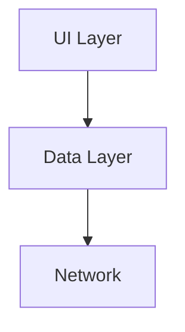

# CLAUDE.md

This file provides guidance to Claude Code (claude.ai/code) when working with code in this repository.

---

## Project Overview

**Jetpack Android Starter** is a production-ready Android template built on the foundation of [Now In Android](https://github.com/android/nowinandroid) architecture. It provides a comprehensive starting point for modern Android development with:

- Clean Architecture (pragmatic two-layer: UI + Data)
- Jetpack Compose UI with Material3
- Firebase integration (Auth, Firestore, Crashlytics)
- Type-safe navigation with Kotlin serialization
- Offline-first data management with Room + Repository pattern
- Background sync with WorkManager
- Comprehensive documentation system (Dokka + MkDocs)

**Key Philosophy**: Pragmatic simplicity - complex patterns are only added when necessary.

---

## Build Commands

### Development Builds
```bash
# Clean build
./gradlew clean build

# Debug APK
./gradlew assembleDebug

# Release APK (requires signing configuration)
./gradlew assembleRelease

# Install debug build on connected device
./gradlew installDebug
```

### Code Quality
```bash
# Run code formatting check (DO NOT format manually - use this!)
./gradlew spotlessCheck

# Apply code formatting
./gradlew spotlessApply

# IMPORTANT: Always run spotlessApply before committing!
```

### Documentation Generation
```bash
# Generate API documentation with Dokka (outputs to build/dokka/html/)
./gradlew dokkaGeneratePublicationHtml

# Generate complete documentation site (Dokka + MkDocs)
# Requires Python and mkdocs installed: pip install mkdocs mkdocs-material
./gradlew dokkaGeneratePublicationHtml
mkdir -p docs/api
mv build/dokka/html/* docs/api/
cp README.md docs/index.md
mkdocs serve  # View at http://localhost:8000
```

### Testing
```bash
# Run all unit tests
./gradlew test

# Run tests for specific module
./gradlew :core:ui:test

# Run tests with coverage report
./gradlew testDebugUnitTest
```

---

## High-Level Architecture

### Two-Layer Architecture (UI + Data)

This template **intentionally omits the domain layer** to reduce complexity. ViewModels call repositories directly.

```
┌─────────────────────────────────────────────────┐
│ UI Layer                                        │
│ ┌──────────────┐  ┌─────────────┐             │
│ │ Composables  │  │ ViewModels  │             │
│ │ (Pure UI)    │◄─┤ (State Mgmt)│             │
│ └──────────────┘  └─────────────┘             │
│                         │                       │
│                         ▼                       │
│                   ┌──────────────┐             │
│                   │  UiState<T>  │             │
│                   │  Wrapper     │             │
│                   └──────────────┘             │
└─────────────────────────────────────────────────┘
                          │
                          ▼
┌─────────────────────────────────────────────────┐
│ Data Layer                                      │
│ ┌──────────────┐  ┌─────────────┐             │
│ │ Repositories │◄─┤ Data Sources│             │
│ │ (Coordination)│  │(Network/DB) │             │
│ └──────────────┘  └─────────────┘             │
│  Single Source        ▲         ▲              │
│  of Truth             │         │              │
│                    Network    Room             │
└─────────────────────────────────────────────────┘
```

**Key Points**:
- Composables are pure functions that receive state and emit events
- ViewModels manage `UiState<ScreenData>` and handle business logic
- Repositories coordinate between local (Room, DataStore) and remote (Network, Firebase) data sources
- Local database is always the single source of truth (offline-first)

### Module Structure

```
.
├── app/                        # Main application module
├── core/                       # Core functionality modules
│   ├── android/               # Android utilities, DI qualifiers, extensions
│   ├── network/               # Retrofit, OkHttp, network data sources
│   ├── preferences/           # DataStore, user preferences
│   ├── room/                  # Room database, DAOs, entities
│   └── ui/                    # Compose components, UiState, theme
├── data/                      # Repository implementations
├── feature/                   # Feature modules
│   ├── auth/                  # Authentication screens
│   ├── home/                  # Home screen
│   ├── profile/               # User profile
│   └── settings/              # App settings
├── firebase/                  # Firebase wrappers
│   ├── analytics/            # Firebase Crashlytics (crash reporting)
│   ├── auth/                 # Firebase Authentication
│   └── firestore/            # Cloud Firestore
├── sync/                      # WorkManager background sync
└── build-logic/              # Gradle convention plugins
    └── convention/           # Custom Gradle plugins for standardization
```

**Module Dependencies Flow**:
- `app` → all feature modules → `core/ui` + `data`
- `data` → all core modules + firebase modules
- `core/*` → no dependencies on other project modules (reusable)
- `feature/*` → `core/ui` + `data` (never depend on other features)

### Convention Plugins

This project uses **Gradle Convention Plugins** in `build-logic/convention/` to standardize build configuration:

- **ApplicationConventionPlugin**: Base Android application setup
- **LibraryConventionPlugin**: Base Android library setup
- **UiLibraryConventionPlugin**: Compose + Material3 library setup
- **DaggerHiltConventionPlugin**: Hilt dependency injection setup
- **FirebaseConventionPlugin**: Firebase services setup
- **DokkaConventionPlugin**: API documentation generation

**Why Convention Plugins?** They eliminate build.gradle.kts duplication and ensure consistent configuration across all modules.

**When adding a new module**, apply the appropriate convention plugin instead of manually configuring Android/Kotlin/Compose settings.

### State Management Pattern

**Core Concept**: `UiState<T>` wrapper for consistent loading/error handling.

```kotlin
// All screens follow this pattern:

// 1. Define screen data (immutable state)
data class HomeScreenData(
    val items: List<Item> = emptyList(),
    val selectedId: String? = null
)

// 2. ViewModel wraps state in UiState
@HiltViewModel
class HomeViewModel @Inject constructor(
    private val repository: HomeRepository
) : ViewModel() {
    private val _uiState = MutableStateFlow(UiState(HomeScreenData()))
    val uiState = _uiState.asStateFlow()

    // State updates use helper functions
    fun updateData() {
        _uiState.updateStateWith {  // Auto-handles loading/error
            repository.fetchData()
        }
    }
}

// 3. Route composable connects to ViewModel
@Composable
fun HomeRoute(
    onShowSnackbar: suspend (String, SnackbarAction, Throwable?) -> Boolean,
    viewModel: HomeViewModel = hiltViewModel()
) {
    val uiState by viewModel.uiState.collectAsStateWithLifecycle()

    StatefulComposable(  // Handles loading indicator + error snackbar
        state = uiState,
        onShowSnackbar = onShowSnackbar
    ) { screenData ->
        HomeScreen(screenData, viewModel::updateData)
    }
}

// 4. Screen composable is pure UI (no ViewModel, fully testable)
@Composable
private fun HomeScreen(
    screenData: HomeScreenData,
    onAction: () -> Unit
) {
    // UI implementation
}
```

**Key Utilities** (in `core/ui/src/main/kotlin/dev/atick/core/ui/utils/`):
- `UiState<T>`: Wrapper with data, loading, and error fields
- `StatefulComposable`: Centralized loading/error display
- `updateState { }`: Synchronous state updates
- `updateStateWith { }`: Async state updates with automatic loading/error handling
- `updateWith { }`: Same as updateStateWith but for state modification
- `OneTimeEvent<T>`: Ensures events (errors, messages) are consumed only once
- `UiText`: Type-safe text (string resources or dynamic strings) without Context dependency

**Context Parameters**: This project uses Kotlin's `-Xcontext-parameters` feature. The `updateStateWith` and `updateWith` functions automatically access the ViewModel's scope - you don't need to pass `viewModelScope`.

---

## Documentation Rules

**CRITICAL**: When working with documentation, follow these rules to avoid breaking the build:

### 1. Module README First Lines
**NEVER change the first line** of any module-level README.md file. Dokka requires this exact format:

```markdown
# Module :module:name
```

The first line must always be `# Module :` followed by the exact module path (e.g., `:core:ui`, `:data`, `:feature:auth`). Changing this format will break Dokka's API documentation generation.

### 2. Markdown Formatting Standard
**Use CommonMark specification** for all markdown formatting. This ensures compatibility across GitHub, MkDocs, and Dokka.

Key guidelines:
- Use ATX headings (`#`, `##`, `###`)
- Always specify language in code fences (` ```kotlin`, ` ```bash`)
- Use consistent list markers (either `*` or `-`, not mixed)
- Properly escape special characters

### 3. Mermaid Charts
**Use Mermaid charts** instead of static images or ASCII art for:
- Architecture diagrams
- Data flow diagrams
- Module dependency graphs
- Navigation graphs
- Component selection flowcharts

Example:
````markdown

````

### 4. GitHub-Flavored Admonitions
**Always use GitHub-flavored admonitions** for callouts:

```markdown
> [!NOTE]
> Informational content that users should be aware of.

> [!TIP]
> Helpful advice or best practices.

> [!IMPORTANT]
> Critical information that requires attention.

> [!WARNING]
> Warnings about potential issues or pitfalls.

> [!CAUTION]
> Information about dangerous operations or irreversible actions.
```

**DO NOT use** other formats like `!!!note` or custom HTML.

### 5. No Tree-Line File Structures
**NEVER include tree-line file structures** in documentation. Dokka has a known issue that causes build errors with ASCII tree diagrams.

**BAD** (causes Dokka errors):
```
project/
├── app/
│   ├── src/
│   └── build.gradle.kts
└── core/
    └── ui/
```

**GOOD** (use lists or descriptions):
```
- `app/` - Main application module
  - `src/` - Source code
  - `build.gradle.kts` - Build configuration
- `core/ui/` - UI components module
```

Or use Mermaid diagrams for complex hierarchies.

---

## Documentation System

This project has a **dual-documentation system**:

### 1. Module READMEs → Dokka API Reference

- Each module has a `README.md` in its root (e.g., `/core/ui/README.md`)
- These READMEs are processed by Dokka and appear as the module overview page in API docs
- **Convention**: Module READMEs focus on module architecture, when to use the module, and key patterns
- Module README files are included in Dokka via `DokkaConventionPlugin.kt`:
  ```kotlin
  dokkaSourceSets.named("main") {
      includes.from("README.md")  // This includes the module's README
  }
  ```

### 2. Guide Documentation → MkDocs Site

- General documentation in `/docs/*.md` (architecture, guides, tutorials)
- Built with MkDocs Material theme
- Navigation structure defined in `mkdocs.yml`
- Deployed via GitHub Actions (`.github/workflows/docs.yml`)
- **Convention**: Guide docs focus on concepts, patterns, and how-to guides

### Documentation Workflow

```
┌──────────────────────────┐     ┌──────────────────────────┐
│ Source Code KDocs        │────▶│ Dokka HTML              │
│ Module READMEs           │     │ (build/dokka/html/)     │
└──────────────────────────┘     └──────────────────────────┘
                                            │
                                            ▼
┌──────────────────────────┐     ┌──────────────────────────┐
│ docs/*.md files          │────▶│ MkDocs Site             │
│ README.md → docs/index.md│     │ (site/)                 │
│ Dokka output → docs/api/ │     └──────────────────────────┘
└──────────────────────────┘                │
                                            ▼
                                   GitHub Pages Deployment
```

**Important**: When updating documentation:
1. **Module-specific API details** → Update module README.md and KDocs
2. **Architectural patterns** → Update relevant `/docs/*.md` file
3. **Cross-cutting concerns** → May need updates in both places

**Current Documentation Issues** (tracked in `CHECKLIST.local.md`):
- Some duplication between module READMEs and `/docs/*.md` files
- A few broken links to API docs (require Dokka generation first)
- `/docs/performance.md` and `/docs/faq.md` need expansion

---

## Key Development Patterns

### Adding a New Feature

Follow the guide in `/docs/guide.md`. High-level steps:

1. **Create data models** in appropriate core module (network DTOs, Room entities)
2. **Implement data sources** (NetworkDataSource, LocalDataSource)
3. **Create repository** in `:data` module with interface + implementation
4. **Build UI layer**:
   - Define `ScreenData` data class
   - Create `ViewModel` with `UiState<ScreenData>`
   - Implement `Route` composable (connects to ViewModel)
   - Implement `Screen` composable (pure UI, no ViewModel)
5. **Set up navigation** (type-safe routes with `@Serializable`)
6. **Configure DI** (Hilt modules with `@Binds`)

**Important**: Always separate Route (ViewModel-aware) from Screen (pure UI) for testability.

### Type-Safe Navigation

Navigation uses **Kotlin Serialization** for type safety:

```kotlin
// 1. Define routes with @Serializable
@Serializable
data object HomeNavGraph

@Serializable
data object Home

@Serializable
data class Profile(val userId: String)

// 2. Create extension functions for type-safe navigation
fun NavController.navigateToProfile(userId: String) {
    navigate(Profile(userId))
}

// 3. Register routes in NavGraphBuilder
fun NavGraphBuilder.homeNavGraph() {
    navigation<HomeNavGraph>(startDestination = Home) {
        composable<Home> { HomeRoute(...) }
        composable<Profile> { backStackEntry ->
            val profile: Profile = backStackEntry.toRoute()
            ProfileRoute(userId = profile.userId, ...)
        }
    }
}
```

**Never use string routes** - always use `@Serializable` data classes/objects.

### Repository Pattern (Offline-First)

All repositories follow the **single source of truth** pattern:

```kotlin
class FeatureRepositoryImpl @Inject constructor(
    private val localDataSource: LocalDataSource,  // Room
    private val networkDataSource: NetworkDataSource,  // Retrofit
    @IoDispatcher private val ioDispatcher: CoroutineDispatcher
) : FeatureRepository {

    // UI observes local database (single source of truth)
    override fun observeItems(): Flow<List<Item>> =
        localDataSource.observeItems()
            .map { entities -> entities.map { it.toDomain() } }

    // Network updates local database in background
    override suspend fun syncItems(): Result<Unit> = suspendRunCatching {
        val networkItems = networkDataSource.getItems()
        localDataSource.saveItems(networkItems.map { it.toEntity() })
    }
}
```

**Key principles**:
- Local database is **always** the source of truth
- UI **never** reads directly from network
- Background sync updates local database
- Use `suspendRunCatching` for error handling in repositories
- Return `Flow<T>` for observable data, `Result<T>` for one-shot operations

### Dependency Injection with Hilt

**Module Organization**:
- Data sources: Core module DI modules (e.g., `core/network/src/main/kotlin/dev/atick/core/network/di/`)
- Repositories: `:data` module DI modules
- ViewModels: Automatically injected via `@HiltViewModel`

**Dispatcher Qualifiers** (defined in `:core:android`):
```kotlin
@IoDispatcher val ioDispatcher: CoroutineDispatcher  // For IO operations (network, database)
@DefaultDispatcher val defaultDispatcher: CoroutineDispatcher  // For CPU-intensive work
@MainDispatcher val mainDispatcher: CoroutineDispatcher  // For main thread (rare - use collectAsStateWithLifecycle instead)
```

**Common DI Pattern**:
```kotlin
@Module
@InstallIn(SingletonComponent::class)
abstract class RepositoryModule {
    @Binds
    @Singleton
    abstract fun bindRepository(impl: RepositoryImpl): Repository
}
```

### Error Handling

**Repository Layer**:
```kotlin
// Always use suspendRunCatching
override suspend fun fetchData(): Result<Data> = suspendRunCatching {
    val networkData = networkDataSource.getData()
    localDataSource.saveData(networkData)
}
```

**ViewModel Layer**:
```kotlin
// updateStateWith handles errors automatically
fun loadData() {
    _uiState.updateStateWith {  // Auto-sets loading = true/false, captures errors
        repository.fetchData()
    }
}
```

**UI Layer**:
```kotlin
// StatefulComposable displays errors via snackbar
StatefulComposable(
    state = uiState,
    onShowSnackbar = onShowSnackbar  // Shows error message with optional retry
) { screenData ->
    // UI only renders on success
}
```

### Firebase Integration

Firebase modules are **wrappers** around Firebase SDKs:

- **firebase:auth** - Abstracts Firebase Auth (Google Sign-In, email/password)
- **firebase:firestore** - Provides reactive Firestore access (Flow-based)
- **firebase:analytics** - Firebase Crashlytics crash reporting (not Analytics)

**Pattern**:
```kotlin
// Repository uses Firebase wrapper
class UserRepositoryImpl @Inject constructor(
    private val firebaseAuth: FirebaseAuthWrapper,
    private val firestore: FirestoreWrapper
) : UserRepository {
    override fun observeCurrentUser(): Flow<User?> =
        firebaseAuth.currentUserFlow()
            .map { it?.toDomain() }
}
```

**Important**: Firebase setup requires `google-services.json`. See `/docs/firebase.md`.

---

## Testing Strategy

**Note**: Testing infrastructure is planned but not fully implemented in this template.

**When adding tests**:

1. **Repository tests** - Test with fake data sources (in-memory)
2. **ViewModel tests** - Test state management with fake repositories
3. **Composable tests** - Test Screen composables (pure UI) with Compose test APIs
4. **Integration tests** - Test full feature flows with Hilt test modules

**Key testing utilities** (when implemented):
- Fake data sources for testing repositories
- Test dispatchers (use `StandardTestDispatcher` for coroutine tests)
- Compose preview tests (test `@Preview` annotated composables)

---

## Gradle Version Catalogs

Dependencies are managed via Gradle Version Catalogs (`gradle/libs.versions.toml`).

**To add a new dependency**:

1. Add version to `[versions]` section:
   ```toml
   [versions]
   coil = "2.5.0"
   ```

2. Add library to `[libraries]` section:
   ```toml
   [libraries]
   coil = { group = "io.coil-kt", name = "coil-compose", version.ref = "coil" }
   ```

3. Reference in module's `build.gradle.kts`:
   ```kotlin
   dependencies {
       implementation(libs.coil)
   }
   ```

**Never hardcode versions** in build.gradle.kts files. Always use version catalogs.

---

## Firebase Setup

**Required for building**:

1. Download `google-services.json` from Firebase Console
2. Place in `app/google-services.json`
3. **Never commit** `google-services.json` to version control (already in .gitignore)

**For testing without Firebase**:
- Use Firebase Local Emulator Suite
- Configure in `:firebase:*` modules

See `/docs/firebase.md` for complete setup guide.

---

## Code Style & Formatting

**DO NOT manually format code**. This project uses **Spotless** with ktlint.

```bash
# Check formatting (runs in CI)
./gradlew spotlessCheck

# Fix formatting (run before committing!)
./gradlew spotlessApply
```

**Pre-commit checklist**:
1. Run `./gradlew spotlessApply`
2. Run `./gradlew build` (ensures no compilation errors)
3. Commit with conventional commit message

**Commit Message Format** (Conventional Commits):
```
<type>(<scope>): <description>

[optional body]

[optional footer]
```

Types: `feat`, `fix`, `docs`, `refactor`, `test`, `chore`, `style`, `perf`

Examples:
- `feat(auth): add password reset functionality`
- `fix(home): resolve crash on empty data`
- `docs: update repository pattern guide`
- `refactor(ui): simplify state management utilities`

---

## Common Tasks

### Add a New Screen
1. Create feature module if needed: `feature:new-feature`
2. Define `ScreenData`, `ViewModel`, `Route`, and `Screen` composables
3. Create `@Serializable` navigation destination
4. Register in app navigation graph
5. Add to bottom navigation or deep link if needed

### Add a New Repository
1. Define data models in `:data/model`
2. Create repository interface in `:data/repository`
3. Implement repository with data sources
4. Add mapper functions (DTO ↔ Entity ↔ Domain)
5. Create Hilt module with `@Binds`

### Add a New API Endpoint
1. Add model to `:core:network/model`
2. Add function to API interface in `:core:network/api`
3. Update NetworkDataSource in `:core:network/data`
4. Update repository to use new endpoint

### Add a New Database Table
1. Create entity in `:core:room/model`
2. Create DAO in `:core:room/dao`
3. Add entity to `JetpackDatabase`
4. Increment database version in `JetpackDatabase`
5. Add migration if needed

### Update Dependencies
1. Edit `gradle/libs.versions.toml`
2. Update version numbers
3. Run `./gradlew build` to verify
4. Test affected features
5. Commit with message: `chore: update dependencies`

---

## CI/CD

### GitHub Actions Workflows

- **`.github/workflows/ci.yml`** - Runs on pull requests
  - Lint check (Spotless)
  - Build project
  - Run tests (when implemented)

- **`.github/workflows/docs.yml`** - Runs on push to `main`
  - Generates Dokka HTML
  - Builds MkDocs site
  - Deploys to GitHub Pages

- **`.github/workflows/cd.yml`** - Runs on release tags
  - Builds release APK
  - Creates GitHub release
  - Uploads APK artifact

**CI Configuration**: `.github/ci-gradle.properties` contains CI-specific Gradle settings.

---

## Important Conventions

### File Naming
- **Composables**: `FeatureScreen.kt` (single file per screen)
- **ViewModels**: `FeatureViewModel.kt`
- **Repositories**: `FeatureRepository.kt` (interface) + `FeatureRepositoryImpl.kt` (implementation)
- **Data Sources**: `FeatureDataSource.kt` (interface) + `FeatureDataSourceImpl.kt`
- **Navigation**: `FeatureNavigation.kt`

### Package Structure (per module)
```
src/main/kotlin/dev/atick/<module>/
├── di/             # Hilt modules
├── model/          # Data classes (entities, DTOs, domain models)
├── ui/             # Composables (if feature module)
├── data/           # Data sources (if core module)
└── repository/     # Repositories (if data module)
```

### Naming Conventions
- **Screen Data**: `FeatureScreenData` (never just `State` - too generic)
- **UI State**: `uiState` (not `state`, `viewState`, etc.)
- **Navigation Routes**: Match screen name (`Home`, `Profile`, `Settings`)
- **Repositories**: `FeatureRepository` (not `FeatureRepo`, `FeatureDataRepository`)

---

## Troubleshooting

### Build Fails with "Could not find google-services.json"
**Solution**: Download from Firebase Console and place in `app/google-services.json`.

### Spotless Check Fails
**Solution**: Run `./gradlew spotlessApply` to auto-format code.

### Dokka Build Fails
**Cause**: Usually due to malformed KDoc or missing module README.
**Solution**: Check error message for file/line number. Ensure KDoc is valid.

### Navigation Type Mismatch
**Cause**: Forgetting to add `@Serializable` to route data class.
**Solution**: Ensure all routes are `@Serializable` and use `toRoute<T>()` for parsing.

### State Not Updating in UI
**Causes**:
1. Not collecting state as `State` in Composable
   **Solution**: Use `collectAsStateWithLifecycle()` not `collectAsState()`
2. Mutating state instead of creating new instance
   **Solution**: Always use `copy()` for data class state updates

### Hilt Dependency Not Found
**Cause**: Missing `@InstallIn` or incorrect component.
**Solution**: Ensure Hilt module has `@InstallIn(SingletonComponent::class)` for app-wide dependencies.

For more troubleshooting, see `/docs/troubleshooting.md`.

---

## Additional Resources

- **Full Documentation**: https://atick.dev/Jetpack-Android-Starter
- **API Reference**: https://atick.dev/Jetpack-Android-Starter/api/
- **GitHub Discussions**: https://github.com/atick-faisal/Jetpack-Android-Starter/discussions
- **Issue Tracker**: https://github.com/atick-faisal/Jetpack-Android-Starter/issues

**Key Documentation Files**:
- `/docs/getting-started.md` - Quick start guide
- `/docs/guide.md` - Adding a new feature step-by-step
- `/docs/architecture.md` - Architecture deep dive
- `/docs/state-management.md` - UiState pattern explained
- `/docs/navigation.md` - Type-safe navigation guide
- `/docs/dependency-injection.md` - Hilt setup and patterns (993 lines!)
- `/docs/quick-reference.md` - Common patterns cheat sheet

---

## Notes for Claude Code

- **Always run `./gradlew spotlessApply`** before committing changes
- **Never manually format code** - Spotless handles it
- **Module READMEs are part of API docs** - keep them focused on module architecture
- **NEVER change module README first lines** - Dokka requires `# Module :module:name` format
- **Use CommonMark + GitHub-flavored admonitions** - for all markdown
- **Use Mermaid for diagrams** - no static images or ASCII art
- **NO tree-line file structures** - causes Dokka build errors
- **Use convention plugins** when adding new modules (see `build-logic/convention/`)
- **Follow the state management pattern** - UiState + StatefulComposable
- **Keep Screen composables pure** - no ViewModel dependency
- **Use type-safe navigation** - always `@Serializable` routes
- **Offline-first repositories** - local database is source of truth
- **Version catalog for dependencies** - never hardcode versions
- **Conventional commits** - use standard commit message format
- **Documentation is critical** - update docs when changing patterns
- **Refer to CHECKLIST.local.md** for ongoing documentation improvements

---

**Last Updated**: 2025-11-07
