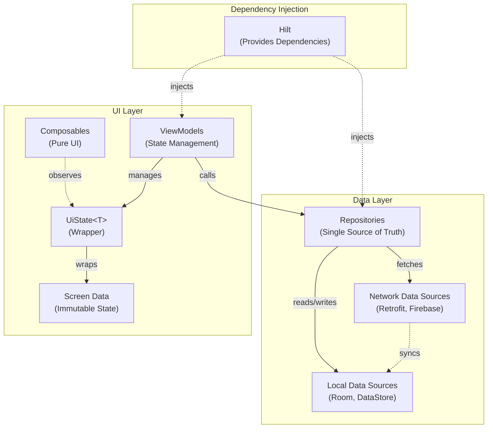
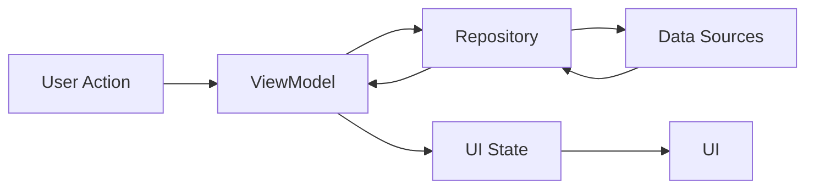
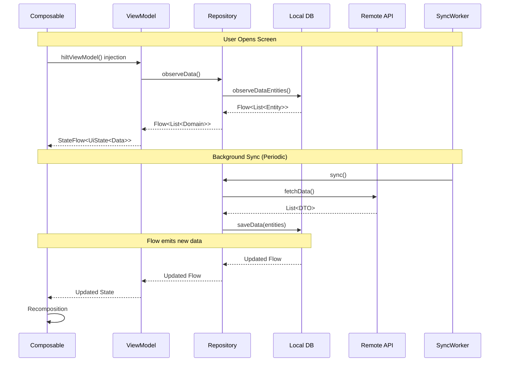

# Architecture Overview

This project follows the
official [Android Architecture Guidelines](https://developer.android.com/topic/architecture) with
some pragmatic adaptations to keep the codebase simple and maintainable.

## Architectural Principles

The architecture is built on several key principles:

1. **Separation of Concerns**: Each component has its own responsibility
2. **Single Source of Truth**: Data is managed in a single place
3. **Unidirectional Data Flow**: Data flows in one direction, events flow in the opposite
4. **State-Based UI**: UI is a reflection of the state
5. **Pragmatic Simplicity**: Complex patterns are only added when necessary

## Core Layers

The app uses a two-layer architecture:



### UI Layer

The UI layer follows MVVM pattern and consists of:

1. **Composables**: Pure UI components built with Jetpack Compose
2. **ViewModels**: Manage UI state and business logic
3. **Screen Data**: Immutable data classes representing screen state

Example UI Layer structure:

```kotlin
data class HomeScreenData(
    val items: List<Item> = emptyList(),
    // other UI state properties
)

@HiltViewModel
class HomeViewModel @Inject constructor(
    private val repository: HomeRepository
) : ViewModel() {
    private val _uiState = MutableStateFlow(UiState(HomeScreenData()))
    val uiState = _uiState.asStateFlow()
}

@Composable
fun HomeScreen(
    screenData: HomeScreenData,
    onAction: (HomeAction) -> Unit
) {
}
```

### Data Layer

The data layer handles data operations and consists of:

1. **Repositories**: Single source of truth for data
2. **Data Sources**: Interface with external systems (API, database, etc.)
3. **Models**: Data representation classes

Example Data Layer structure:

```kotlin
class HomeRepositoryImpl @Inject constructor(
    private val localDataSource: LocalDataSource,
    private val syncManager: SyncManager,
) : HomeRepository {
    // Room is the single source of truth. The remote source never feeds the UI
    // directly — it writes to Room, and Room emits.
    override fun getData(): Flow<List<Data>> {
        syncManager.requestSync()
        return localDataSource.getData().map { it.mapToData() }
    }

    // Writes return Result<T> via suspendRunCatching, never throw into the UI.
    override suspend fun saveData(data: Data): Result<Unit> = suspendRunCatching {
        localDataSource.saveData(data.mapToEntity())
    }
}
```

## Domain Layer

> [!NOTE]
> Unlike the official guidelines, this project has **no domain layer** by design. ViewModels call
> repositories directly, and repositories return simple data classes. This reduces boilerplate and
> indirection — for most features in this template, two layers are sufficient.

If your app grows in complexity, add one with a use-case class per operation:

```kotlin
class GetDataUseCase @Inject constructor(
    private val repository: Repository
) {
    suspend operator fun invoke(params: Params): Result<Data> =
        repository.getData(params)
}
```

Consider adding a domain layer when:

- Multiple ViewModels share business logic
- Business rules become complex
- You need to transform data between layers
- Multiple UI representations of the same underlying data exist

## State Management

The project uses a consistent state management pattern built around a `UiState<T>` wrapper that
combines data, loading, and a one-time error event:

```kotlin
data class UiState<T : Any>(
    val data: T,
    val loading: Boolean = false,
    val error: OneTimeEvent<Throwable?> = OneTimeEvent(null)
)
```

`updateState`, `updateStateWith`, `StatefulComposable`, and Kotlin context parameters are covered in
full in [State Management](state-management.md) — that's the canonical reference for this pattern.

## Dependency Injection

The project uses Hilt for dependency injection:

- **Modules**: Organized by feature and core functionality
- **Scoping**: Primarily uses singleton scope for repositories and data sources
- **Testing**: Enables easy dependency replacement for testing

See [Data Layer](data.md) for the `@Binds`/`@IoDispatcher`/`@AssistedInject` patterns repositories
and the sync worker use.

## Data Flow

1. **User Interaction** → UI Events
2. **ViewModel** → Business Logic
3. **Repository** → Data Operations
4. **DataSource** → External Systems
5. **Back to UI** through StateFlow



## Testing

The template ships a full test harness, not a placeholder: a `:core:testing` module provides shared
fakes and a `MainDispatcherRule`, and `AndroidTest.kt` wires a Robolectric + Compose testing setup into
every module's `build.gradle.kts`. Across the codebase this backs roughly 110 test methods spanning
ViewModels, repositories, and Composables.

## Best Practices

1. **Keep Screen Data Simple**: Only include what's needed for the UI
2. **Single Responsibility**: Each class should have one clear purpose
3. **Error Handling**: Use `Result` type for operations that can fail
4. **Coroutines**: Use structured concurrency with proper scoping
5. **Immutable Data**: Use data classes for state and models

---

## How It Fits Together

Here's how the layers cooperate when a user opens a feature screen, including background sync:



1. **Screen opens** — Hilt injects the ViewModel with its repository, which starts observing local
   data (the single source of truth).
2. **Initial display** — the UI renders immediately from cached data (offline-first).
3. **Background sync** — WorkManager periodically triggers `SyncWorker`, which calls `sync()` on
   repositories to pull from remote and write into the local database.
4. **Automatic update** — the local database write triggers a new Flow emission, which propagates
   through the ViewModel to a UI recomposition with no manual refresh involved.

---

## Summary

This template uses a **two-layer architecture** (UI + Data) for simplicity:

- **UI Layer**: Composables + ViewModels with UiState wrapper
- **Data Layer**: Repositories + Data Sources (Network, Local, Firebase)
- **State Management**: Centralized with `updateState` and `updateStateWith` functions
- **Dependency Injection**: Hilt with feature-based modules
- **Unidirectional Data Flow**: User actions → ViewModel → Repository → Data Sources → UI

The architecture is intentionally simple but allows for growth when needed.

## Further Reading

- [State Management](state-management.md) — deep dive into the `UiState` pattern
- [Data Layer](data.md) — repository pattern, two-way sync, and the Hilt wiring behind them
- [Adding Features](guide.md) — step-by-step guide to implementing new features
- [Core UI Module](https://github.com/atick-faisal/Jetpack-Android-Starter/blob/main/core/ui/README.md) — state management utilities and UI components
