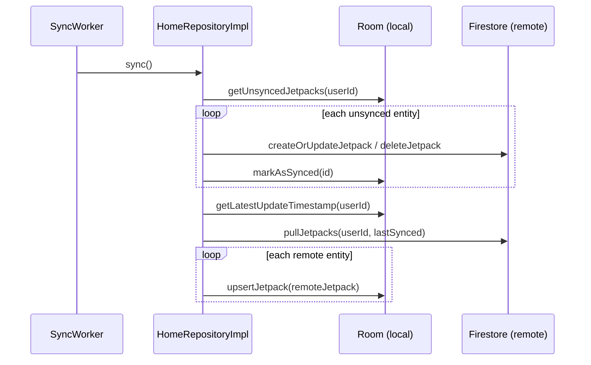

# Data Layer

The data layer is repositories plus data sources — see [Architecture](architecture.md) for where it
sits in the module graph. This page covers the four data sources, the repository pattern that
combines them, how `Result<T>` is produced, and the two-way sync algorithm that keeps a local Room
database and Firestore in agreement.

## Data sources

| Source | Module | Purpose | Key file |
|---|---|---|---|
| Room | `core/room` | Local persistence, single source of truth for the UI | `JetpackDao.kt`, `JetpackEntity.kt` |
| DataStore | `core/preferences` | User profile and app settings (proto-style) | `UserPreferencesDataSourceImpl.kt` |
| Retrofit | `core/network` | Plain REST client | `JetpackRestApi.kt`, `NetworkDataSourceImpl.kt` |
| Firestore | `firebase/firestore` | Remote sync target for the `home` feature | `FirebaseDataSourceImpl.kt` |

`core:network`/`JetpackRestApi` exist as an independent REST option, but `HomeRepositoryImpl`
doesn't use them — it syncs through Firestore only (see the note in [Guide](guide.md#2-data-source)).
Reach for `core:network` if your feature talks to a plain backend instead of Firebase; don't use both
for the same feature.

Room entities that participate in sync carry metadata fields beyond their domain data:

```kotlin
// core/room/src/main/kotlin/dev/atick/core/room/model/JetpackEntity.kt
@Entity(tableName = "jetpacks")
data class JetpackEntity(
    @PrimaryKey val id: String = UUID.randomUUID().toString(),
    val name: String,
    val price: Double,
    val userId: String = String(),
    val lastUpdated: Long = 0,
    val lastSynced: Long = 0,
    val needsSync: Boolean = false,
    val deleted: Boolean = false,
    val syncAction: SyncAction = SyncAction.NONE,
)

enum class SyncAction { NONE, UPSERT, DELETE }
```

`deleted` is a **soft delete** — a row marked deleted is hidden from `getJetpacks()` but kept locally
until it's pushed to Firestore, so the remote deletion isn't lost if the app closes mid-sync.

DataStore and Firestore reads/writes follow the same shape — a `Flow` for observation, a
`CoroutineDispatcher` qualified with `@IoDispatcher` for the actual I/O:

```kotlin
// core/preferences/src/main/kotlin/dev/atick/core/preferences/data/UserPreferencesDataSourceImpl.kt
override fun getUserDataPreferences(): Flow<UserDataPreferences> =
    datastore.data.flowOn(ioDispatcher)
```

```kotlin
// firebase/firestore/src/main/kotlin/dev/atick/firebase/firestore/data/FirebaseDataSourceImpl.kt
override suspend fun pullJetpacks(userId: String, lastSynced: Long): List<FirebaseJetpack> {
    return withContext(ioDispatcher) {
        database.document(checkAuthentication(userId))
            .collection(FirebaseDataSource.JETPACK_COLLECTION_NAME)
            .whereGreaterThan("lastUpdated", lastSynced)
            .get().await().toObjects(FirebaseJetpack::class.java)
    }
}
```

## Repository pattern

A repository is the only thing a ViewModel depends on. Reads return `Flow`, writes return
`Result<Unit>`:

```kotlin
// data/src/main/kotlin/dev/atick/data/repository/home/HomeRepository.kt
interface HomeRepository : Syncable {
    fun getJetpacks(): Flow<List<Jetpack>>
    fun getJetpack(id: String): Flow<Jetpack>
    suspend fun createOrUpdateJetpack(jetpack: Jetpack): Result<Unit>
    suspend fun markJetpackAsDeleted(jetpack: Jetpack): Result<Unit>
}
```

`HomeRepositoryImpl` is the offline-first example — Room is the only thing read for the UI, Firestore
is a sync target that's never read directly by a screen:

```kotlin
// data/src/main/kotlin/dev/atick/data/repository/home/HomeRepositoryImpl.kt
override fun getJetpacks(): Flow<List<Jetpack>> {
    syncManager.requestSync()
    return flow {
        val userId = preferencesDataSource.getUserIdOrThrow()
        emitAll(localDataSource.getJetpacks(userId).map { it.mapToJetpacks() })
    }
}

override suspend fun createOrUpdateJetpack(jetpack: Jetpack): Result<Unit> = suspendRunCatching {
    val userId = preferencesDataSource.getUserIdOrThrow()
    localDataSource.upsertJetpack(
        jetpack.toJetpackEntity().copy(
            userId = userId,
            lastUpdated = System.currentTimeMillis(),
            needsSync = true,
            syncAction = SyncAction.UPSERT,
        ),
    )
    syncManager.requestSync()
}
```

Writes are local-first: Room is updated and flagged `needsSync = true` before `requestSync()` ever
runs, so a write always succeeds even if the sync itself fails or is delayed.

Not every repository syncs. `ProfileRepositoryImpl` and `SettingsRepositoryImpl` are real local-only
examples — DataStore plus Firebase Auth, no Room, no `Syncable`:

```kotlin
// data/src/main/kotlin/dev/atick/data/repository/profile/ProfileRepositoryImpl.kt
override fun getProfile(): Flow<Profile> =
    userPreferencesDataSource.getUserDataPreferences().map { it.toProfile() }

override suspend fun signOut(): Result<Unit> = suspendRunCatching {
    authDataSource.signOut()
    userPreferencesDataSource.resetUserPreferences()
}
```

Every repository is bound to its interface with `@Binds`, one function per repository, in a single
Hilt module:

```kotlin
// data/src/main/kotlin/dev/atick/data/di/RepositoryModule.kt
@Module
@InstallIn(SingletonComponent::class)
abstract class RepositoryModule {
    @Binds
    @Singleton
    internal abstract fun bindHomeRepository(
        homeRepositoryImpl: HomeRepositoryImpl,
    ): HomeRepository

    // ...one @Binds per repository
}
```

`@Binds` over `@Provides` here is just a compile-time cast, not a factory function — appropriate
since every implementation already has an `@Inject constructor` and needs no custom construction
logic.

## Result via `suspendRunCatching`

Repositories never let an exception escape a `suspend` call — every write goes through
`suspendRunCatching`, which behaves like `runCatching` except it re-throws `CancellationException`
instead of swallowing it, so cancelling a coroutine still cancels it:

```kotlin
// core/android/src/main/kotlin/dev/atick/core/utils/CoroutineUtils.kt
suspend inline fun <T> suspendRunCatching(crossinline block: suspend () -> T): Result<T> {
    return try {
        Result.success(block())
    } catch (cancellationException: CancellationException) {
        throw cancellationException
    } catch (exception: Exception) {
        Result.failure(exception)
    }
}
```

Used at the repository boundary only — `HomeRepositoryImpl.createOrUpdateJetpack`,
`ProfileRepositoryImpl.signOut`, and every `AuthRepositoryImpl` sign-in method wrap their body in it.
The resulting `Result<T>` is what a ViewModel passes to `updateStateWith`/`updateWith` — see
[State Management](state-management.md) for how that becomes a `UiState`.

## Two-way sync

`HomeRepositoryImpl` is `Syncable`; its writes and reads both call `syncManager.requestSync()`, which
enqueues a `WorkManager` job:

```kotlin
// sync/src/main/kotlin/dev/atick/sync/manager/Sync.kt
fun initialize(context: Context) {
    WorkManager.getInstance(context).apply {
        enqueueUniqueWork(SYNC_WORK_NAME, ExistingWorkPolicy.KEEP, SyncWorker.startUpSyncWork())
    }
}
```

> [!WARNING]
> `ExistingWorkPolicy.KEEP` silently drops the new request if a sync is already enqueued or running.
> That's what makes calling `requestSync()` from every read and write cheap — it's not naively
> re-triggering a sync each time, and a burst of writes collapses into one sync run.

`SyncWorker` runs the job on `@IoDispatcher`, promoted to a foreground service, and retries up to
`TOTAL_SYNC_ATTEMPTS = 3` times via `Result.retry()`:

```kotlin
// sync/src/main/kotlin/dev/atick/sync/worker/SyncWorker.kt
@HiltWorker
class SyncWorker @AssistedInject constructor(
    @Assisted private val context: Context,
    @Assisted workerParameters: WorkerParameters,
    @IoDispatcher private val ioDispatcher: CoroutineDispatcher,
    private val homeRepository: HomeRepository,
) : CoroutineWorker(context, workerParameters) {

    override suspend fun doWork(): Result = withContext(ioDispatcher) {
        try {
            setForeground(getForegroundInfo())
            homeRepository.sync().flowOn(ioDispatcher).collect { progress ->
                setForeground(getForegroundInfo(progress.total, progress.current))
            }
            Result.success()
        } catch (e: Exception) {
            if (runAttemptCount < TOTAL_SYNC_ATTEMPTS) Result.retry() else Result.failure()
        }
    }
}
```

`SyncWorker` needs `@AssistedInject`/`@Assisted` because WorkManager supplies `Context` and
`WorkerParameters` at runtime, not through the graph — everything else (`homeRepository`,
`ioDispatcher`) is injected normally. It's enqueued through a `DelegatingWorker` so Hilt can construct
it at all (`SyncWorker.startUpSyncWork()`).

The actual algorithm is `HomeRepositoryImpl.sync()` — push local changes, then pull remote ones:

```kotlin
// data/src/main/kotlin/dev/atick/data/repository/home/HomeRepositoryImpl.kt
override suspend fun sync(): Flow<SyncProgress> = flow {
    val userId = preferencesDataSource.getUserIdOrThrow()

    // Push: drain everything Room has flagged as unsynced
    val unsyncedJetpacks = localDataSource.getUnsyncedJetpacks(userId)
    unsyncedJetpacks.forEachIndexed { index, unsyncedJetpack ->
        when (unsyncedJetpack.syncAction) {
            SyncAction.UPSERT -> firebaseDataSource.createOrUpdateJetpack(unsyncedJetpack.toFirebaseJetpack())
            SyncAction.DELETE -> firebaseDataSource.deleteJetpack(unsyncedJetpack.toFirebaseJetpack())
            SyncAction.NONE -> {}
        }
        localDataSource.markAsSynced(unsyncedJetpack.id)
        emit(SyncProgress(unsyncedJetpacks.size, index + 1, "Syncing jetpacks with the cloud"))
    }

    // Pull: fetch anything Firestore has newer than our latest known update
    val lastSynced = localDataSource.getLatestUpdateTimestamp(userId)
    val remoteJetpacks = firebaseDataSource.pullJetpacks(userId, lastSynced)
    remoteJetpacks.forEachIndexed { index, remoteJetpack ->
        localDataSource.upsertJetpack(remoteJetpack.toJetpackEntity())
        emit(SyncProgress(remoteJetpacks.size, index + 1, "Fetching jetpacks from the cloud"))
    }
}
```

`getUnsyncedJetpacks` queries `WHERE lastUpdated > lastSynced OR needsSync = 1`; a successful push
resets both via `markAsSynced` (`needsSync = 0, syncAction = 'NONE', lastSynced = now`). The pull
uses `getLatestUpdateTimestamp` (the max `lastUpdated` across everything already local) as the cursor
into Firestore's `whereGreaterThan("lastUpdated", lastSynced)`.

> [!TIP]
> Push runs before pull, deliberately. Pushing local changes first means a subsequent pull can't
> overwrite them with stale remote data — if pull ran first, a local edit made between the two phases
> would be silently clobbered by whatever the pull just wrote.



## Further reading

- [Architecture](architecture.md) — the two-layer design this repository pattern fits into
- [State Management](state-management.md) — how a repository's `Result<T>` becomes a `UiState`
- [Guide](guide.md) — the full `home` feature walkthrough, repository included
- [Sync module](../sync/README.md) — `SyncManager`, `SyncWorker`, and `WorkManager` constraints
