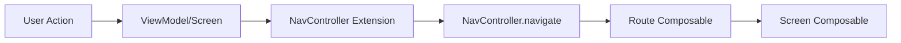

# Navigation Deep Dive

This guide provides a comprehensive overview of navigation in this Android template, which uses Jetpack Navigation Compose with type-safe navigation powered by Kotlin Serialization.

## Table of Contents

- [Overview](#overview)
- [Type-Safe Navigation](#type-safe-navigation)
- [Simple Navigation](#simple-navigation)
- [Navigation with Arguments](#navigation-with-arguments)
- [Nested Navigation Graphs](#nested-navigation-graphs)
- [Deep Linking](#deep-linking)
- [Bottom Navigation](#bottom-navigation)
- [Drawer Navigation](#drawer-navigation)
- [Back Stack Management](#back-stack-management)
- [Navigation Testing](#navigation-testing)
- [Common Patterns](#common-patterns)
- [Best Practices](#best-practices)
- [Troubleshooting](#troubleshooting)

---

## Overview

### Navigation Architecture

This template uses **Jetpack Navigation Compose** with **type-safe navigation** via Kotlin Serialization. This approach provides:

- **Compile-time safety**: Routes are defined as Kotlin objects/data classes
- **Type-safe arguments**: Arguments are passed as typed parameters
- **IDE support**: Auto-completion and refactoring support
- **Reduced errors**: No string-based routes to mess up

### Key Components

```
Navigation Layer
├── Route Definitions (@Serializable objects/data classes)
├── Navigation Extensions (NavController.navigateToX())
├── Graph Builders (NavGraphBuilder.xScreen())
└── NavHost (Top-level navigation setup)
```

### Navigation Flow



---

## Type-Safe Navigation

### Defining Routes

Routes are defined as `@Serializable` objects or data classes:

```kotlin
// Simple route without arguments
@Serializable
data object Home

// Route with required arguments
@Serializable
data class ProfileDetail(val userId: String)

// Route with optional arguments
@Serializable
data class ArticleDetail(
    val articleId: String,
    val scrollToComments: Boolean = false
)

// Navigation graph
@Serializable
data object ProfileNavGraph
```

**Why use @Serializable?**
- Kotlin Serialization automatically handles serialization/deserialization
- Type-safe argument passing with compile-time checking
- No manual string parsing or type conversion
- Supports complex types (enums, lists, custom classes)

### Route Organization

Organize routes by feature module:

```kotlin
// feature/profile/navigation/ProfileNavigation.kt
package dev.atick.profile.navigation

import kotlinx.serialization.Serializable

@Serializable
data object ProfileNavGraph

@Serializable
data object Profile

@Serializable
data class ProfileDetail(val userId: String)

@Serializable
data class EditProfile(
    val userId: String,
    val section: ProfileSection? = null
)

enum class ProfileSection {
    BASIC_INFO,
    CONTACT,
    PREFERENCES
}
```

---

## Simple Navigation

### NavController Extension

Create extension functions for type-safe navigation:

```kotlin
// feature/profile/navigation/ProfileNavigation.kt
fun NavController.navigateToProfile(navOptions: NavOptions? = null) {
    navigate(Profile, navOptions)
}

fun NavController.navigateToProfileDetail(
    userId: String,
    navOptions: NavOptions? = null
) {
    navigate(ProfileDetail(userId = userId), navOptions)
}
```

**Benefits:**
- Centralized navigation logic
- Consistent API across features
- Easy to find all navigation entry points
- Supports NavOptions for advanced behavior

### Graph Builder Extension

Create extension functions to register screens:

```kotlin
// feature/profile/navigation/ProfileNavigation.kt
fun NavGraphBuilder.profileScreen(
    onShowSnackbar: suspend (String, SnackbarAction, Throwable?) -> Boolean,
    onNavigateToDetail: (String) -> Unit
) {
    composable<Profile> {
        ProfileRoute(
            onShowSnackbar = onShowSnackbar,
            onNavigateToDetail = onNavigateToDetail
        )
    }
}

fun NavGraphBuilder.profileDetailScreen(
    onShowSnackbar: suspend (String, SnackbarAction, Throwable?) -> Boolean,
    onNavigateBack: () -> Unit
) {
    composable<ProfileDetail> { backStackEntry ->
        val args = backStackEntry.toRoute<ProfileDetail>()
        ProfileDetailRoute(
            userId = args.userId,
            onShowSnackbar = onShowSnackbar,
            onNavigateBack = onNavigateBack
        )
    }
}
```

### NavHost Setup

Wire up navigation in your main activity or top-level composable:

```kotlin
// app/src/main/kotlin/dev/atick/jetpack/ui/JetpackApp.kt
@Composable
fun JetpackApp(
    navController: NavHostController = rememberNavController()
) {
    val snackbarHostState = remember { SnackbarHostState() }

    Scaffold(
        snackbarHost = { SnackbarHost(snackbarHostState) }
    ) { paddingValues ->
        NavHost(
            navController = navController,
            startDestination = Home,
            modifier = Modifier.padding(paddingValues)
        ) {
            homeScreen(
                onShowSnackbar = { message, action, error ->
                    // Handle snackbar
                    true
                },
                onNavigateToProfile = { userId ->
                    navController.navigateToProfileDetail(userId)
                }
            )

            profileScreen(
                onShowSnackbar = { /* ... */ },
                onNavigateToDetail = { userId ->
                    navController.navigateToProfileDetail(userId)
                }
            )

            profileDetailScreen(
                onShowSnackbar = { /* ... */ },
                onNavigateBack = { navController.navigateUp() }
            )
        }
    }
}
```

---

## Navigation with Arguments

### Required Arguments

Pass required data via constructor parameters:

```kotlin
// Define route with required arguments
@Serializable
data class ArticleDetail(
    val articleId: String,
    val source: String
)

// Navigation extension
fun NavController.navigateToArticleDetail(
    articleId: String,
    source: String,
    navOptions: NavOptions? = null
) {
    navigate(
        ArticleDetail(articleId = articleId, source = source),
        navOptions
    )
}

// Screen registration
fun NavGraphBuilder.articleDetailScreen(
    onShowSnackbar: suspend (String, SnackbarAction, Throwable?) -> Boolean,
    onNavigateBack: () -> Unit
) {
    composable<ArticleDetail> { backStackEntry ->
        val args = backStackEntry.toRoute<ArticleDetail>()

        ArticleDetailRoute(
            articleId = args.articleId,
            source = args.source,
            onShowSnackbar = onShowSnackbar,
            onNavigateBack = onNavigateBack
        )
    }
}
```

### Optional Arguments

Use default parameter values for optional arguments:

```kotlin
@Serializable
data class ArticleDetail(
    val articleId: String,
    val scrollToComments: Boolean = false,
    val highlightCommentId: String? = null
)

// Navigation with optional arguments
fun NavController.navigateToArticleDetail(
    articleId: String,
    scrollToComments: Boolean = false,
    highlightCommentId: String? = null,
    navOptions: NavOptions? = null
) {
    navigate(
        ArticleDetail(
            articleId = articleId,
            scrollToComments = scrollToComments,
            highlightCommentId = highlightCommentId
        ),
        navOptions
    )
}

// Usage
navController.navigateToArticleDetail("article-123") // Use defaults
navController.navigateToArticleDetail(
    articleId = "article-123",
    scrollToComments = true,
    highlightCommentId = "comment-456"
)
```

### Complex Types

Kotlin Serialization supports complex argument types:

```kotlin
// Enum arguments
enum class FilterType {
    ALL, FAVORITES, ARCHIVED
}

@Serializable
data class ArticleList(
    val filter: FilterType = FilterType.ALL
)

// List arguments (use @Serializable-compatible types)
@Serializable
data class MultiSelect(
    val selectedIds: List<String> = emptyList()
)

// Custom serializable types
@Serializable
data class DateRange(
    val startDate: String, // Use ISO 8601 format
    val endDate: String
)

@Serializable
data class Reports(
    val dateRange: DateRange
)
```

### Argument Validation

Validate arguments in the Route composable:

```kotlin
@Composable
fun ArticleDetailRoute(
    articleId: String,
    onShowSnackbar: suspend (String, SnackbarAction, Throwable?) -> Boolean,
    onNavigateBack: () -> Unit,
    viewModel: ArticleDetailViewModel = hiltViewModel()
) {
    // Validate arguments
    LaunchedEffect(articleId) {
        if (articleId.isBlank()) {
            onShowSnackbar("Invalid article ID", SnackbarAction.DISMISS, null)
            onNavigateBack()
            return@LaunchedEffect
        }
        viewModel.loadArticle(articleId)
    }

    val uiState by viewModel.uiState.collectAsStateWithLifecycle()

    StatefulComposable(
        state = uiState,
        onShowSnackbar = onShowSnackbar
    ) { screenData ->
        ArticleDetailScreen(
            screenData = screenData,
            onNavigateBack = onNavigateBack
        )
    }
}
```

---

## Nested Navigation Graphs

### Defining Nested Graphs

Group related screens into navigation graphs:

```kotlin
// feature/profile/navigation/ProfileNavigation.kt
@Serializable
data object ProfileNavGraph

@Serializable
data object Profile

@Serializable
data class ProfileDetail(val userId: String)

@Serializable
data class EditProfile(val userId: String)

// feature/settings/navigation/SettingsNavigation.kt
@Serializable
data object SettingsNavGraph

@Serializable
data object Settings

@Serializable
data object AccountSettings

@Serializable
data object PrivacySettings
```

### Creating Nested Graphs

Use `navigation()` to create nested graphs:

```kotlin
fun NavGraphBuilder.profileGraph(
    onShowSnackbar: suspend (String, SnackbarAction, Throwable?) -> Boolean,
    navController: NavController
) {
    navigation<ProfileNavGraph>(
        startDestination = Profile
    ) {
        profileScreen(
            onShowSnackbar = onShowSnackbar,
            onNavigateToDetail = { userId ->
                navController.navigateToProfileDetail(userId)
            }
        )

        profileDetailScreen(
            onShowSnackbar = onShowSnackbar,
            onNavigateToEdit = { userId ->
                navController.navigateToEditProfile(userId)
            },
            onNavigateBack = { navController.navigateUp() }
        )

        editProfileScreen(
            onShowSnackbar = onShowSnackbar,
            onNavigateBack = { navController.navigateUp() }
        )
    }
}
```

### Using Nested Graphs

Include nested graphs in the main NavHost:

```kotlin
@Composable
fun JetpackApp(
    navController: NavHostController = rememberNavController()
) {
    NavHost(
        navController = navController,
        startDestination = Home
    ) {
        homeScreen(
            onShowSnackbar = { /* ... */ },
            onNavigateToProfile = {
                navController.navigate(ProfileNavGraph)
            }
        )

        profileGraph(
            onShowSnackbar = { /* ... */ },
            navController = navController
        )

        settingsGraph(
            onShowSnackbar = { /* ... */ },
            navController = navController
        )
    }
}
```

### Navigating to Nested Graphs

Navigate to the root of a nested graph:

```kotlin
// Navigate to ProfileNavGraph (starts at Profile screen)
navController.navigate(ProfileNavGraph)

// Navigate directly to a specific screen in the graph
navController.navigateToProfileDetail("user-123")
```

### Shared ViewModels in Nested Graphs

Share ViewModels across screens in a nested graph:

```kotlin
@Composable
fun ProfileDetailRoute(
    userId: String,
    onShowSnackbar: suspend (String, SnackbarAction, Throwable?) -> Boolean,
    onNavigateBack: () -> Unit
) {
    val navBackStackEntry = LocalNavController.current
        .getBackStackEntry<ProfileNavGraph>()

    // Shared ViewModel scoped to ProfileNavGraph
    val sharedViewModel: ProfileSharedViewModel = hiltViewModel(navBackStackEntry)

    // Screen-specific ViewModel
    val viewModel: ProfileDetailViewModel = hiltViewModel()

    // Use both ViewModels...
}
```

---

## Deep Linking

### Defining Deep Links

Deep links allow external sources to navigate directly into your app:

```kotlin
// feature/article/navigation/ArticleNavigation.kt
@Serializable
data class ArticleDetail(val articleId: String)

fun NavGraphBuilder.articleDetailScreen(
    onShowSnackbar: suspend (String, SnackbarAction, Throwable?) -> Boolean,
    onNavigateBack: () -> Unit
) {
    composable<ArticleDetail>(
        deepLinks = listOf(
            navDeepLink<ArticleDetail>(
                basePath = "https://example.com/article"
            ),
            navDeepLink<ArticleDetail>(
                basePath = "example://article"
            )
        )
    ) { backStackEntry ->
        val args = backStackEntry.toRoute<ArticleDetail>()

        ArticleDetailRoute(
            articleId = args.articleId,
            onShowSnackbar = onShowSnackbar,
            onNavigateBack = onNavigateBack
        )
    }
}
```

### Android Manifest Configuration

Declare deep links in `AndroidManifest.xml`:

```xml
<activity
    android:name=".MainActivity"
    android:exported="true">

    <!-- App Links (HTTPS) -->
    <intent-filter android:autoVerify="true">
        <action android:name="android.intent.action.VIEW" />
        <category android:name="android.intent.category.DEFAULT" />
        <category android:name="android.intent.category.BROWSABLE" />

        <data
            android:scheme="https"
            android:host="example.com"
            android:pathPrefix="/article" />
    </intent-filter>

    <!-- Custom URI Scheme -->
    <intent-filter>
        <action android:name="android.intent.action.VIEW" />
        <category android:name="android.intent.category.DEFAULT" />
        <category android:name="android.intent.category.BROWSABLE" />

        <data
            android:scheme="example"
            android:host="article" />
    </intent-filter>
</activity>
```

### Testing Deep Links

**ADB Command:**
```bash
# HTTPS deep link
adb shell am start -W -a android.intent.action.VIEW \
  -d "https://example.com/article/article-123"

# Custom URI scheme
adb shell am start -W -a android.intent.action.VIEW \
  -d "example://article/article-123"
```

**From Code:**
```kotlin
val intent = Intent(Intent.ACTION_VIEW).apply {
    data = Uri.parse("https://example.com/article/article-123")
}
startActivity(intent)
```

### Handling Deep Link Arguments

Extract arguments from the route as usual:

```kotlin
composable<ArticleDetail>(
    deepLinks = listOf(/* ... */)
) { backStackEntry ->
    val args = backStackEntry.toRoute<ArticleDetail>()

    // args.articleId contains the value from the deep link
    ArticleDetailRoute(
        articleId = args.articleId,
        // ...
    )
}
```

### App Links Verification

For HTTPS deep links (App Links), create a Digital Asset Links file:

**Host at:** `https://example.com/.well-known/assetlinks.json`

```json
[{
  "relation": ["delegate_permission/common.handle_all_urls"],
  "target": {
    "namespace": "android_app",
    "package_name": "dev.atick.jetpack",
    "sha256_cert_fingerprints": [
      "YOUR_RELEASE_KEY_SHA256"
    ]
  }
}]
```

**Get SHA-256 fingerprint:**
```bash
keytool -list -v -keystore /path/to/keystore.jks
```

---

## Bottom Navigation

### Bottom Navigation Setup

Create a bottom navigation bar with multiple top-level destinations:

```kotlin
// Define bottom navigation destinations
enum class TopLevelDestination(
    val route: Any,
    val icon: ImageVector,
    val label: String
) {
    HOME(
        route = Home,
        icon = Icons.Default.Home,
        label = "Home"
    ),
    EXPLORE(
        route = Explore,
        icon = Icons.Default.Search,
        label = "Explore"
    ),
    PROFILE(
        route = Profile,
        icon = Icons.Default.Person,
        label = "Profile"
    )
}

@Composable
fun JetpackApp(
    navController: NavHostController = rememberNavController()
) {
    val navBackStackEntry by navController.currentBackStackEntryAsState()
    val currentDestination = navBackStackEntry?.destination

    Scaffold(
        bottomBar = {
            // Only show bottom bar for top-level destinations
            val showBottomBar = TopLevelDestination.entries.any { destination ->
                currentDestination?.hasRoute(destination.route::class) == true
            }

            if (showBottomBar) {
                NavigationBar {
                    TopLevelDestination.entries.forEach { destination ->
                        val selected = currentDestination?.hasRoute(
                            destination.route::class
                        ) == true

                        NavigationBarItem(
                            selected = selected,
                            onClick = {
                                navController.navigate(destination.route) {
                                    // Pop to start destination to avoid stack buildup
                                    popUpTo(navController.graph.findStartDestination().id) {
                                        saveState = true
                                    }
                                    // Avoid multiple copies of same destination
                                    launchSingleTop = true
                                    // Restore state when reselecting a previously selected item
                                    restoreState = true
                                }
                            },
                            icon = {
                                Icon(
                                    imageVector = destination.icon,
                                    contentDescription = destination.label
                                )
                            },
                            label = { Text(destination.label) }
                        )
                    }
                }
            }
        }
    ) { paddingValues ->
        NavHost(
            navController = navController,
            startDestination = Home,
            modifier = Modifier.padding(paddingValues)
        ) {
            // Register screens...
        }
    }
}
```

### Bottom Navigation Best Practices

**State Preservation:**
```kotlin
navController.navigate(destination) {
    popUpTo(navController.graph.findStartDestination().id) {
        saveState = true  // Save state when navigating away
    }
    launchSingleTop = true  // Avoid duplicates
    restoreState = true  // Restore state when returning
}
```

**Conditional Bottom Bar:**
```kotlin
// Hide bottom bar for detail screens
val hideBottomBarDestinations = setOf(
    ProfileDetail::class,
    ArticleDetail::class,
    EditProfile::class
)

val showBottomBar = hideBottomBarDestinations.none { route ->
    currentDestination?.hasRoute(route) == true
}
```

---

## Drawer Navigation

### Drawer Setup

Create a navigation drawer for additional destinations:

```kotlin
@Composable
fun JetpackApp(
    navController: NavHostController = rememberNavController()
) {
    val drawerState = rememberDrawerState(DrawerValue.Closed)
    val scope = rememberCoroutineScope()
    val navBackStackEntry by navController.currentBackStackEntryAsState()
    val currentDestination = navBackStackEntry?.destination

    ModalNavigationDrawer(
        drawerState = drawerState,
        drawerContent = {
            ModalDrawerSheet {
                Text(
                    text = "My App",
                    modifier = Modifier.padding(16.dp),
                    style = MaterialTheme.typography.titleLarge
                )

                HorizontalDivider()

                DrawerDestination.entries.forEach { destination ->
                    val selected = currentDestination?.hasRoute(
                        destination.route::class
                    ) == true

                    NavigationDrawerItem(
                        icon = {
                            Icon(
                                imageVector = destination.icon,
                                contentDescription = null
                            )
                        },
                        label = { Text(destination.label) },
                        selected = selected,
                        onClick = {
                            navController.navigate(destination.route) {
                                popUpTo(navController.graph.findStartDestination().id)
                                launchSingleTop = true
                            }
                            scope.launch {
                                drawerState.close()
                            }
                        },
                        modifier = Modifier.padding(NavigationDrawerItemDefaults.ItemPadding)
                    )
                }
            }
        }
    ) {
        Scaffold(
            topBar = {
                TopAppBar(
                    title = { Text("Home") },
                    navigationIcon = {
                        IconButton(
                            onClick = {
                                scope.launch {
                                    drawerState.open()
                                }
                            }
                        ) {
                            Icon(
                                imageVector = Icons.Default.Menu,
                                contentDescription = "Open drawer"
                            )
                        }
                    }
                )
            }
        ) { paddingValues ->
            NavHost(
                navController = navController,
                startDestination = Home,
                modifier = Modifier.padding(paddingValues)
            ) {
                // Register screens...
            }
        }
    }
}
```

### Drawer Destinations

Define drawer navigation items:

```kotlin
enum class DrawerDestination(
    val route: Any,
    val icon: ImageVector,
    val label: String
) {
    HOME(Home, Icons.Default.Home, "Home"),
    FAVORITES(Favorites, Icons.Default.Favorite, "Favorites"),
    SETTINGS(Settings, Icons.Default.Settings, "Settings"),
    ABOUT(About, Icons.Default.Info, "About")
}
```

---

## Back Stack Management

### Understanding the Back Stack

The back stack is a LIFO (Last In, First Out) stack of destinations:

```
[Home] -> [Profile] -> [ProfileDetail] -> [EditProfile]
                                          ↑ Current
```

### Navigating Up

Go back one step in the back stack:

```kotlin
// In your composable
IconButton(onClick = { navController.navigateUp() }) {
    Icon(Icons.Default.ArrowBack, contentDescription = "Back")
}

// navigateUp() vs popBackStack()
navController.navigateUp() // Preferred: handles up navigation properly
navController.popBackStack() // Lower-level, less safe
```

### Pop to Destination

Remove destinations until reaching a specific one:

```kotlin
// Pop back to Home, removing all intermediate screens
navController.navigate(Home) {
    popUpTo(Home) {
        inclusive = true // Include Home itself in the pop
    }
}

// Example: Logout flow - clear entire back stack
navController.navigate(Login) {
    popUpTo(navController.graph.id) {
        inclusive = true
    }
}
```

### Single Top Launch Mode

Avoid duplicate destinations in the stack:

```kotlin
navController.navigate(Profile) {
    launchSingleTop = true // Don't add if already on top
}
```

### Clearing the Back Stack

Useful for login/logout flows:

```kotlin
// After successful login - navigate to Home and clear login screens
navController.navigate(Home) {
    popUpTo(navController.graph.id) {
        inclusive = true
    }
}

// After logout - navigate to Login and clear everything
navController.navigate(Login) {
    popUpTo(navController.graph.id) {
        inclusive = true
    }
}
```

### Save and Restore State

Preserve state when navigating:

```kotlin
navController.navigate(destination) {
    popUpTo(navController.graph.findStartDestination().id) {
        saveState = true
    }
    launchSingleTop = true
    restoreState = true
}
```

### Back Press Handling

Handle back press with `BackHandler`:

```kotlin
@Composable
fun UnsavedChangesScreen(
    onNavigateBack: () -> Unit,
    viewModel: EditViewModel = hiltViewModel()
) {
    val hasUnsavedChanges by viewModel.hasUnsavedChanges.collectAsState()
    var showDialog by remember { mutableStateOf(false) }

    BackHandler(enabled = hasUnsavedChanges) {
        showDialog = true
    }

    if (showDialog) {
        AlertDialog(
            onDismissRequest = { showDialog = false },
            title = { Text("Unsaved Changes") },
            text = { Text("You have unsaved changes. Are you sure you want to leave?") },
            confirmButton = {
                TextButton(
                    onClick = {
                        showDialog = false
                        onNavigateBack()
                    }
                ) {
                    Text("Leave")
                }
            },
            dismissButton = {
                TextButton(onClick = { showDialog = false }) {
                    Text("Stay")
                }
            }
        )
    }

    // Screen content...
}
```

---

## Navigation Testing

### Testing Navigation Actions

Test that navigation happens correctly:

```kotlin
@OptIn(ExperimentalTestApi::class)
class ProfileNavigationTest {

    @get:Rule
    val composeTestRule = createAndroidComposeRule<ComponentActivity>()

    private lateinit var navController: TestNavHostController

    @Before
    fun setup() {
        composeTestRule.setContent {
            navController = TestNavHostController(LocalContext.current).apply {
                navigatorProvider.addNavigator(ComposeNavigator())
            }

            NavHost(navController = navController, startDestination = Profile) {
                profileScreen(
                    onShowSnackbar = { _, _, _ -> true },
                    onNavigateToDetail = { userId ->
                        navController.navigateToProfileDetail(userId)
                    }
                )

                profileDetailScreen(
                    onShowSnackbar = { _, _, _ -> true },
                    onNavigateBack = { navController.navigateUp() }
                )
            }
        }
    }

    @Test
    fun navigateToDetail_updatesCurrentDestination() {
        // Navigate to detail
        composeTestRule.runOnUiThread {
            navController.navigateToProfileDetail("user-123")
        }

        // Verify current destination
        composeTestRule.runOnUiThread {
            val currentRoute = navController.currentBackStackEntry?.toRoute<ProfileDetail>()
            assertEquals("user-123", currentRoute?.userId)
        }
    }

    @Test
    fun clickBackButton_navigatesUp() {
        // Navigate to detail
        composeTestRule.runOnUiThread {
            navController.navigateToProfileDetail("user-123")
        }

        // Click back button
        composeTestRule.onNodeWithContentDescription("Back").performClick()

        // Verify navigation
        composeTestRule.runOnUiThread {
            val currentRoute = navController.currentBackStackEntry?.destination?.hasRoute<Profile>()
            assertTrue(currentRoute == true)
        }
    }
}
```

### Testing Deep Links

Test that deep links navigate correctly:

```kotlin
@Test
fun deepLink_navigatesToArticleDetail() {
    val uri = "https://example.com/article/article-123"

    composeTestRule.setContent {
        val navController = rememberNavController()

        NavHost(navController = navController, startDestination = Home) {
            homeScreen(/* ... */)

            articleDetailScreen(
                onShowSnackbar = { _, _, _ -> true },
                onNavigateBack = { navController.navigateUp() }
            )
        }

        // Simulate deep link
        LaunchedEffect(Unit) {
            navController.handleDeepLink(
                Intent(Intent.ACTION_VIEW, Uri.parse(uri))
            )
        }
    }

    // Verify article detail is shown
    composeTestRule.onNodeWithText("Article Detail").assertIsDisplayed()
}
```

### Testing Back Stack

Test back stack behavior:

```kotlin
@Test
fun backStack_preservesState() {
    val navController = TestNavHostController(
        ApplicationProvider.getApplicationContext()
    ).apply {
        navigatorProvider.addNavigator(ComposeNavigator())
    }

    // Navigate through several screens
    navController.navigate(Home)
    navController.navigate(Profile)
    navController.navigate(Settings)

    // Verify back stack size
    assertEquals(3, navController.backQueue.size)

    // Pop back
    navController.popBackStack()

    // Verify current destination
    val currentRoute = navController.currentBackStackEntry?.destination?.hasRoute<Profile>()
    assertTrue(currentRoute == true)
}
```

---

## Common Patterns

### Conditional Navigation

Navigate based on state:

```kotlin
@Composable
fun HomeRoute(
    onShowSnackbar: suspend (String, SnackbarAction, Throwable?) -> Boolean,
    onNavigateToAuth: () -> Unit,
    onNavigateToMain: () -> Unit,
    viewModel: HomeViewModel = hiltViewModel()
) {
    val isAuthenticated by viewModel.isAuthenticated.collectAsStateWithLifecycle()

    LaunchedEffect(isAuthenticated) {
        if (!isAuthenticated) {
            onNavigateToAuth()
        }
    }

    // Rest of the screen...
}
```

### Navigation After Async Operation

Navigate after an async operation completes:

```kotlin
@Composable
fun CreateArticleRoute(
    onShowSnackbar: suspend (String, SnackbarAction, Throwable?) -> Boolean,
    onNavigateToDetail: (String) -> Unit,
    viewModel: CreateArticleViewModel = hiltViewModel()
) {
    val uiState by viewModel.uiState.collectAsStateWithLifecycle()

    // Navigate when article is created
    LaunchedEffect(uiState.data.createdArticleId) {
        uiState.data.createdArticleId?.let { articleId ->
            onNavigateToDetail(articleId)
        }
    }

    StatefulComposable(
        state = uiState,
        onShowSnackbar = onShowSnackbar
    ) { screenData ->
        CreateArticleScreen(
            screenData = screenData,
            onSubmit = viewModel::createArticle
        )
    }
}
```

### Multi-Step Flow

Implement a multi-step wizard or onboarding flow:

```kotlin
// Define steps
@Serializable
data object OnboardingStep1

@Serializable
data object OnboardingStep2

@Serializable
data object OnboardingStep3

// Shared ViewModel for the entire flow
@HiltViewModel
class OnboardingViewModel @Inject constructor(
    private val userRepository: UserRepository
) : ViewModel() {
    private val _userData = MutableStateFlow(OnboardingData())
    val userData = _userData.asStateFlow()

    fun updateStep1(name: String, email: String) {
        _userData.update { it.copy(name = name, email = email) }
    }

    fun updateStep2(preferences: Preferences) {
        _userData.update { it.copy(preferences = preferences) }
    }

    suspend fun completeOnboarding(): Result<Unit> = suspendRunCatching {
        userRepository.saveOnboardingData(_userData.value)
    }
}

// Share ViewModel across steps
@Composable
fun OnboardingStep1Route(
    onNavigateToStep2: () -> Unit
) {
    val navBackStackEntry = LocalNavController.current
        .getBackStackEntry<OnboardingNavGraph>()

    val sharedViewModel: OnboardingViewModel = hiltViewModel(navBackStackEntry)

    OnboardingStep1Screen(
        onNext = { name, email ->
            sharedViewModel.updateStep1(name, email)
            onNavigateToStep2()
        }
    )
}
```

### Result Passing Between Screens

Pass results back to the previous screen:

```kotlin
// Using SavedStateHandle to pass results
@HiltViewModel
class SelectItemViewModel @Inject constructor(
    private val savedStateHandle: SavedStateHandle
) : ViewModel() {
    fun selectItem(itemId: String) {
        savedStateHandle["selected_item_id"] = itemId
    }
}

@Composable
fun SelectItemRoute(
    onNavigateBack: () -> Unit,
    viewModel: SelectItemViewModel = hiltViewModel()
) {
    SelectItemScreen(
        onItemClick = { itemId ->
            viewModel.selectItem(itemId)
            onNavigateBack()
        }
    )
}

// Retrieve result in previous screen
@Composable
fun ParentRoute(
    onNavigateToSelectItem: () -> Unit,
    viewModel: ParentViewModel = hiltViewModel()
) {
    val navController = LocalNavController.current
    val navBackStackEntry = navController.currentBackStackEntry

    val selectedItemId = navBackStackEntry
        ?.savedStateHandle
        ?.getStateFlow<String?>("selected_item_id", null)
        ?.collectAsState()

    LaunchedEffect(selectedItemId?.value) {
        selectedItemId?.value?.let { itemId ->
            viewModel.handleSelectedItem(itemId)
            // Clear the result
            navBackStackEntry.savedStateHandle.remove<String>("selected_item_id")
        }
    }

    // Screen content...
}
```

---

## Best Practices

### Do's

✅ **Use type-safe navigation**
```kotlin
// Good: Type-safe
navController.navigate(ProfileDetail(userId = "123"))

// Avoid: String-based routes
navController.navigate("profile/123")
```

✅ **Create navigation extensions**
```kotlin
// Centralize navigation logic
fun NavController.navigateToProfile(userId: String) {
    navigate(ProfileDetail(userId = userId))
}
```

✅ **Separate Route and Screen composables**
```kotlin
// Route: Handles ViewModel and navigation
@Composable
fun ProfileRoute(
    onNavigateBack: () -> Unit,
    viewModel: ProfileViewModel = hiltViewModel()
) {
    val uiState by viewModel.uiState.collectAsStateWithLifecycle()

    StatefulComposable(uiState, onShowSnackbar) { screenData ->
        ProfileScreen(screenData, onNavigateBack)
    }
}

// Screen: Pure UI, no navigation knowledge
@Composable
fun ProfileScreen(
    screenData: ProfileScreenData,
    onNavigateBack: () -> Unit
) {
    // UI only
}
```

✅ **Use NavOptions for complex navigation**
```kotlin
navController.navigate(Home) {
    popUpTo(Login) { inclusive = true }
    launchSingleTop = true
}
```

✅ **Handle back press with BackHandler**
```kotlin
BackHandler(enabled = hasUnsavedChanges) {
    showConfirmationDialog = true
}
```

### Don'ts

❌ **Don't pass NavController to composables**
```kotlin
// Bad: Screen shouldn't know about NavController
@Composable
fun ProfileScreen(navController: NavController) { }

// Good: Use callbacks
@Composable
fun ProfileScreen(onNavigateBack: () -> Unit) { }
```

❌ **Don't use string-based routes**
```kotlin
// Avoid
composable("profile/{userId}") { }

// Use type-safe routes instead
composable<ProfileDetail> { }
```

❌ **Don't navigate in ViewModels**
```kotlin
// Bad: ViewModel shouldn't know about navigation
class ProfileViewModel : ViewModel() {
    fun onBackClick(navController: NavController) {
        navController.navigateUp()
    }
}

// Good: Use events or callbacks
class ProfileViewModel : ViewModel() {
    private val _navigationEvent = MutableSharedFlow<NavigationEvent>()
    val navigationEvent = _navigationEvent.asSharedFlow()

    fun onBackClick() {
        viewModelScope.launch {
            _navigationEvent.emit(NavigationEvent.NavigateBack)
        }
    }
}
```

❌ **Don't forget to handle configuration changes**
```kotlin
// Navigation state is preserved automatically by Navigation Compose
// But ensure you use rememberNavController() properly

@Composable
fun JetpackApp() {
    // Good: Navigation state survives config changes
    val navController = rememberNavController()

    NavHost(navController = navController, /* ... */)
}
```

---

## Troubleshooting

### Common Issues

#### Issue: Arguments not passed correctly

**Problem:** Arguments are null or have wrong values.

**Solution:**
```kotlin
// Ensure route is defined with correct parameter names
@Serializable
data class ProfileDetail(val userId: String) // Parameter name matters

// Use toRoute<T>() to extract arguments
composable<ProfileDetail> { backStackEntry ->
    val args = backStackEntry.toRoute<ProfileDetail>()
    // args.userId is now available
}
```

#### Issue: Back stack not clearing

**Problem:** Back button doesn't behave as expected.

**Solution:**
```kotlin
// Clear specific destinations
navController.navigate(Home) {
    popUpTo(Login) {
        inclusive = true
    }
}

// Clear entire back stack
navController.navigate(Home) {
    popUpTo(navController.graph.id) {
        inclusive = true
    }
}
```

#### Issue: Deep links not working

**Problem:** App doesn't open when clicking deep links.

**Solution:**
1. Verify AndroidManifest.xml has correct intent filters
2. Check android:autoVerify="true" for App Links
3. Verify assetlinks.json is accessible
4. Test with ADB:
```bash
adb shell am start -W -a android.intent.action.VIEW \
  -d "https://example.com/article/123"
```

#### Issue: Bottom bar shows on detail screens

**Problem:** Bottom navigation bar visible on screens where it shouldn't be.

**Solution:**
```kotlin
val hideBottomBarDestinations = setOf(
    ProfileDetail::class,
    EditProfile::class
)

val showBottomBar = hideBottomBarDestinations.none { route ->
    currentDestination?.hasRoute(route) == true
}

if (showBottomBar) {
    NavigationBar { /* ... */ }
}
```

#### Issue: State not preserved

**Problem:** Screen state is lost when navigating back.

**Solution:**
```kotlin
// Enable state saving in NavOptions
navController.navigate(destination) {
    popUpTo(navController.graph.findStartDestination().id) {
        saveState = true
    }
    restoreState = true
}

// Use rememberSaveable for screen state
var searchQuery by rememberSaveable { mutableStateOf("") }
```

#### Issue: Nested graph navigation not working

**Problem:** Can't navigate within nested graphs.

**Solution:**
```kotlin
// Pass NavController to nested graph builder
fun NavGraphBuilder.profileGraph(
    navController: NavController,
    onShowSnackbar: suspend (String, SnackbarAction, Throwable?) -> Boolean
) {
    navigation<ProfileNavGraph>(startDestination = Profile) {
        profileScreen(
            onShowSnackbar = onShowSnackbar,
            onNavigateToDetail = { userId ->
                // Use the passed NavController
                navController.navigateToProfileDetail(userId)
            }
        )
    }
}
```

---

## Additional Resources

- **Jetpack Navigation Compose Docs**: [Official Documentation](https://developer.android.com/jetpack/compose/navigation)
- **Type-Safe Navigation**: [Kotlin Serialization Navigation](https://developer.android.com/guide/navigation/design/type-safety)
- **Deep Linking Guide**: [Android Deep Links](https://developer.android.com/training/app-links)
- **API Reference**: See the [Dokka API Documentation](/api/) for detailed navigation function signatures
- **Quick Reference**: See [Quick Reference Guide](quick-reference.md#navigation) for navigation cheat sheet

---

## Summary

This guide covered:
- ✅ Type-safe navigation with Kotlin Serialization
- ✅ Simple and complex navigation patterns
- ✅ Navigation with required and optional arguments
- ✅ Nested navigation graphs
- ✅ Deep linking (HTTPS and custom schemes)
- ✅ Bottom navigation setup
- ✅ Navigation drawer implementation
- ✅ Back stack management
- ✅ Navigation testing strategies
- ✅ Common navigation patterns
- ✅ Best practices and anti-patterns
- ✅ Troubleshooting common issues

**Key Takeaways:**
1. Always use type-safe navigation with `@Serializable` routes
2. Separate navigation logic (Route) from UI (Screen)
3. Create navigation extension functions for consistency
4. Use NavOptions for complex back stack manipulation
5. Test navigation flows with TestNavHostController
6. Never pass NavController to composables - use callbacks
7. Handle back press with BackHandler when needed
